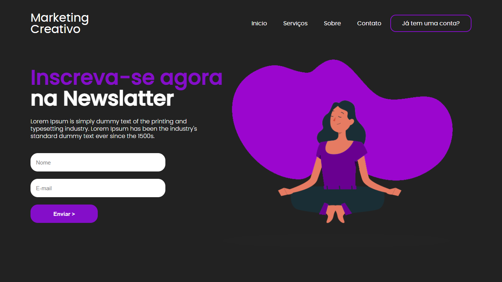

# Landing Page 3

Um simples site para aplicar os conhecimentos de CSS adquiridos no curso THE ODIN PROJECT.

## _[Vizualizar o site](https://quelzynh0.github.io/landing-page-3/)_

**Resumo do projeto:** Implementar um site a partir de um derterminado design encontrado na web.

